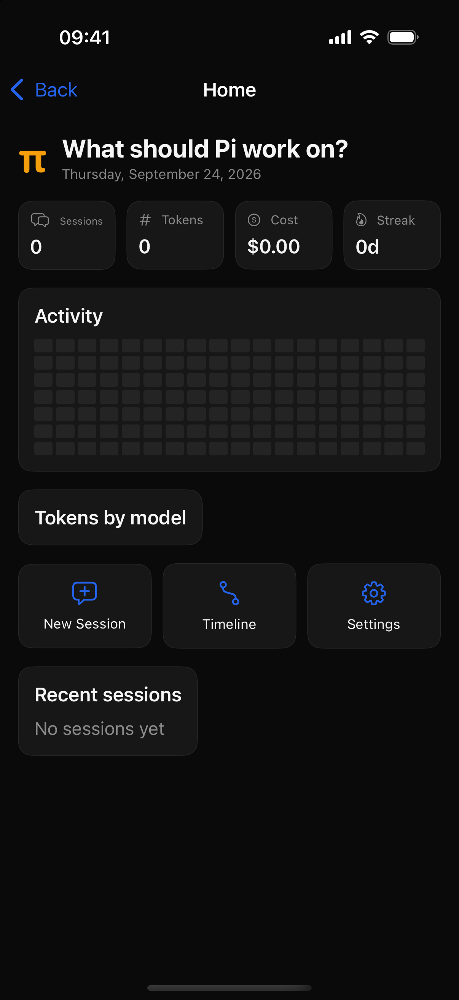

# Pi Mobile

[](https://github.com/winmin/pi-mobile/actions/workflows/ci.yml)

A mobile companion for the [Pi coding agent](https://pi.dev) — a native SwiftUI port of [pi-desktop](../pi-desktop)'s chat experience for iPhone and iPad.

Chat directly against your own LLM providers with streaming, manage sessions, track real activity, and switch themes. No backend required — the app talks to model APIs over HTTPS.

<p align="center">
  
</p>

## Features

- **Streaming chat** — token-by-token SSE rendering with Markdown, code blocks, thinking blocks, and a blinking cursor
- **Bring your own provider** — built-in Anthropic / OpenAI presets plus custom OpenAI-compatible endpoints (base URL + API key + model list), mirroring pi's provider config model
- **OAuth sign-in** — same flows as the pi agent:
  - **Claude (Anthropic)** — authorization code + PKCE with manual redirect-URL paste
  - **ChatGPT (OpenAI Codex)** — device code flow plus the Codex Responses streaming adapter
  - Credentials stored in the iOS Keychain, tokens auto-refresh before expiry
- **Sessions** — grouped by project, rename / archive / delete, per-session token usage
- **Remote Pi plugin** — pair multiple computers by QR with `remote-pi`, then choose the Remote Pi used by each app session
- **Session persistence** — conversations are saved locally (JSON in Application Support) and survive app restarts; active session is restored
- **Timeline** — a real activity log of your prompts, responses, tool calls and approvals (persisted locally)
- **Home dashboard** — sessions / tokens / cost stats, activity heatmap, per-model usage — all computed from your actual usage
- **Themes** — Dark / Light / Nord / Gruvbox / Breeze Light, using pi-desktop's seed-color token system
- **Command palette** — ⌘K quick switcher (iPad / hardware keyboard)
- **Backend per session** — choose Direct API, Remote WebSocket, or Remote Pi when creating a session

## Requirements

- Xcode 16+ (developed on Xcode 27)
- iOS 17.0+
- No third-party dependencies

## Build & run

```bash
open PiApp.xcodeproj
# or
xcodebuild -project PiApp.xcodeproj -scheme PiApp \
  -destination 'platform=iOS Simulator,name=iPhone 17 Pro' \
  CODE_SIGNING_ALLOWED=NO build
```

For a physical device: select your team in **Signing & Capabilities**, or pass
`DEVELOPMENT_TEAM=<your-team-id> -allowProvisioningUpdates` to `xcodebuild`.

### Unsigned iOS build

GitHub Actions builds an unsigned device `.ipa` on every push and pull request;
version tags also publish that CI-built artifact to GitHub Releases. It is built
for arm64 devices running iOS 17 or newer and does not contain a provisioning
profile. Download it from the Releases page, sign it with your own Apple
Developer identity/profile, and then install the re-signed build on your device.

## Configure a provider

1. Open **Settings → AI Providers → Manage Providers**
2. Pick a built-in provider (or **Add Provider** for a custom endpoint)
3. Paste an **API key**, or **Sign in with Claude (OAuth)** / **Sign in with ChatGPT (device code)**
4. Select the model in **Settings → AI Providers**, then chat

If you chat before configuring a provider, the assistant will point you to Settings.

## Connect over LAN

Two LAN-direct options, no relay involved:

**pi-lan-bridge extension (recommended)** — runs inside your pi/omp process,
sharing the agent's live session, credentials and tools:

```bash
pi install ./extension        # see extension/README.md
```

**pi-bridge script** — a standalone zero-config bridge that spawns
`pi/omp --mode rpc` subprocesses (see [bridge/README.md](bridge/README.md)):

```bash
node bridge/pi-bridge.mjs --binary omp
```

For both: **Settings → Agent → Backend → Remote (WebSocket)**, enter the LAN
URL (e.g. `ws://192.168.1.5:7777`), tap **Reconnect**. Both devices must be on
the same network. Streaming, tool-call rendering, permission approvals and
token usage all work.

## Connect the Remote Pi plugin

The **Remote (WebSocket)** backend above is the LAN-direct path. The Remote Pi
plugin is a separate backend with its own pairing flow (works across networks
via a relay). This integration and the app icon use the official
[`remote-pi` package](https://pi.dev/packages/remote-pi) and its published
brand assets.

1. On the computer running Pi, install the extension: `pi install npm:remote-pi`
2. In Pi run `/remote-pi`, then `/remote-pi pair`
3. In the app open **Settings → Remote Pi Plugin → Pair with Pi**
4. Scan the QR code (or paste its `remotepi://` link)

The relay URL defaults to Remote Pi's public relay and can be changed for a
self-hosted relay before pairing. Repeat the pairing flow to add more Remote Pi
peers. When creating a session, choose its paired Pi from the **Remote Pi**
picker. That choice is stored with the session; switching sessions reconnects
to the corresponding Pi. You can reassign the active session from a peer's menu
under **Settings → Remote Pi Plugin**, or long-press any row in **Sessions** and
choose **Run with Remote Pi**.

## Architecture

```
PiApp/
├── Core/
│   ├── Agent/        # AgentClient protocol + Remote Pi / WebSocket / LLM implementations
│   ├── AI/           # ProviderStore, OAuthManager, LLMChatClient (SSE), Keychain
│   ├── Models/       # ChatSession, ChatMessage, ToolCall, TimelineEntry, ActivityStats
│   ├── Store/        # AppModel (@Observable) — navigation, sessions, events, stats
│   ├── Theme/        # PiTheme — seed colors → derived tokens (pi-desktop compatible)
│   └── Mock/         # MockData — demo content, loaded only in Mock mode
└── Views/            # Root (split view), Home, Chat, Sessions, Timeline, Settings, CommandPalette
```

The `AgentClient` protocol abstracts the chat backend:

| Backend | Purpose |
|---|---|
| `LLMChatClient` | Direct HTTPS SSE chat with your provider (default) |
| `WebSocketAgentClient` | Experimental JSONL-over-WebSocket client for a remote `pi --mode rpc` host |
| `RemotePiAgentClient` | Native client for the separately installed `remote-pi` relay/plugin protocol |

### Debug launch arguments

Useful for UI tests and screenshots:

```bash
xcrun simctl launch booted dev.pi.ios.swing -uiRoute timeline
xcrun simctl launch booted dev.pi.ios.swing -uiSend "hello"
xcrun simctl launch booted dev.pi.ios.swing -uiSeedProvider http://127.0.0.1:8899/v1 my-model
```

## License

Apache-2.0. OAuth client identifiers and provider logic are derived from the
[pi](https://github.com/earendil-works/pi) agent (Apache-2.0).
